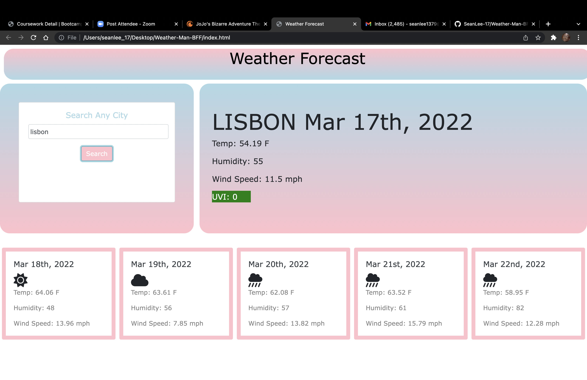

# Weather-Man-BFF

## Description

In this assignment we were tasked with creating a website that would accurately display the current weather of whichever city the user input while also displaying the forecast for the next 5 days. We were given a third party API called One Call Weather that could be manipulated in a way to spit out this information to us. In order to do this I had to create three separate functions in order to convert the information that this API into legible information that the user can view. 

## "You can stand under my umbrella" -Rihanna

The first function was for the current temperature of the city in which I was able to add the information onto a card that I pulled from Bootstrap. The next function was much more challenging as I had to create cards through JavaScript that would display the future forecast. Since this was a lot more infomation to process compared to the first function, I spent the majority of my time working on this function. I also had to add icons that would display that days weather that I had to retrieve from another API called FontAwesome. The last function I created was used to store and display the past cities that were inputted. 

## Languages and API's Used

- HTML
- CSS
- JavaScript
- Bootstrap
- jQuery
- Moment.js
- FontAwesome
- One Call Weather

## Links

- [Github Repository](https://github.com/SeanLee-17/Weather-Man-BFF)
- [Live Website](https://seanlee-17.github.io/Weather-Man-BFF/)

## Screenshot

